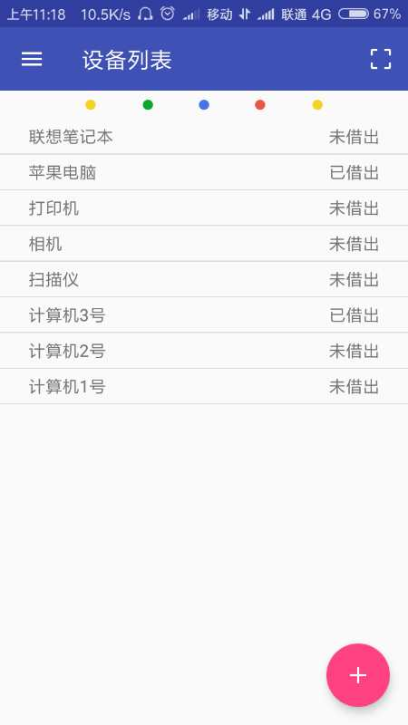
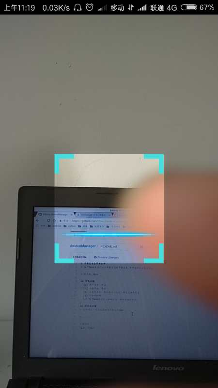

# 实验室设备管理软件
> 基于Bmob实现的一个实验室设备管理系统,用于实验室设备的借还。

> 技术栈:Java

> IDE:Android Studio

## 实现功能
- [x] 用户注册、登录
- [x] 设备添加、借还
- [x] 设备的显示，包括状态、地址、借阅记录等信息
- [x] 二维码扫描
- [x] 基于Web版本的二维码打印，调用本地打印机

## 待实现功能
> 打印功能，该功能依赖于打印机的SDK

> ......
## 第三方包
1. [android-zxingLibrary](https://github.com/yipianfengye/android-zxingLibrary)
2. [Bmob Android SDK](https://github.com/bmob/bmob-android-sdk)

## 页面示例
### 首页

### 设备列表

### 添加设备

### 设备详情

### 二维码扫描

### 侧栏

### 使用记录

